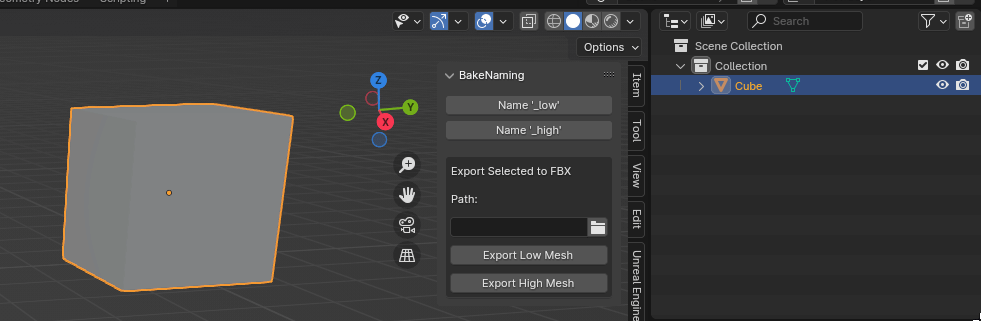

# BakeNaming

A Blender addon that allows you to append "_low" or "_high" to the names of 3D object and export named objects for bake.

### Features
- Append '_low': Adds "_low" to the name of the selected object(s).
- Append '_high': Adds "_high" to the name of the selected object(s).
- Export Named Meshes to FBX: Exports the objects with name "_low" or "_high" to an FBX file. The export path can be specified by the user.

## Installation and Usage

1. In Blender, go to Edit > Preferences > Addons.
2. Click the "Install" button and select the addon script file.
3. Enable the "BakeNaming" addon.
4. You can find the "BakeNaming" panel in sidebar in Blender.